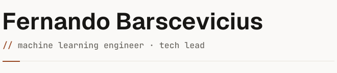

<picture>
  <source media="(prefers-color-scheme: dark)" srcset="assets/header-dark.svg">
  <source media="(prefers-color-scheme: light)" srcset="assets/header-light.svg">
  
</picture>

 

> I build machine learning systems, lead the teams that ship them, and write widely.

Staff-level, eight years in. Specialized in NLP and LLMs, fine-tuning language models, RAG, and agents, working across the full ML spectrum and the infrastructure it runs on. Independent now, taking ML contracts through [Anvilwright](https://anvilwright.com), my software company, with writing and open source as the current focus.

## `// writing`

Notes, essays, and build-logs. AI and machine learning, cognition and health, technology, leadership, building software, philosophy. Published on [anvilwright.com](https://anvilwright.com/writing).

<!-- BLOG-POST-LIST:START -->
- [no one in particular](https://anvilwright.com/writing/no-one-in-particular/) 2026-06-08
- [a tool for thinking](https://anvilwright.com/writing/a-tool-for-thinking/) 2026-06-06
- [the reps you stop taking](https://anvilwright.com/writing/the-reps-you-stop-taking/) 2026-06-01
- [a compression of a compression](https://anvilwright.com/writing/a-compression-of-a-compression/) 2026-05-31
- [the brain drives the tool](https://anvilwright.com/writing/the-brain-drives-the-tool/) 2026-05-22
<!-- BLOG-POST-LIST:END -->

[All writing on anvilwright.com](https://anvilwright.com/writing) &rarr;

## `// stack`

- `ml / ds` &middot; PyTorch, scikit-learn, Hugging Face, pandas, NumPy
- `llm` &middot; fine-tuning, RAG, agents, LangGraph, SLMs
- `cloud / mlops` &middot; AWS, SageMaker, Bedrock, GCP, Vertex AI, Docker, Airflow
- `data` &middot; Python, SQL, PySpark, BigQuery, Redshift

## `// open source`

**[prism](https://github.com/fbarscevicius/prism)**
Retrieval-grounded, multi-perspective research for Claude Code. Refracts one question into expert angles, grounds each in real sources, and verifies its own claims.
Claude Code plugin &middot; MIT

**[cross-session-memory](https://github.com/fbarscevicius/cross-session-memory)**
Near-real-time cross-session memory for OpenClaw. Propagates the durable facts you state across an agent's isolated channels, safely and cheaply.
OpenClaw plugin, TypeScript &middot; MIT

## `// elsewhere`

[anvilwright.com](https://anvilwright.com) &middot; [linkedin](https://linkedin.com/in/fbarscevicius) &middot; [fernando@anvilwright.com](mailto:fernando@anvilwright.com)

São Paulo

